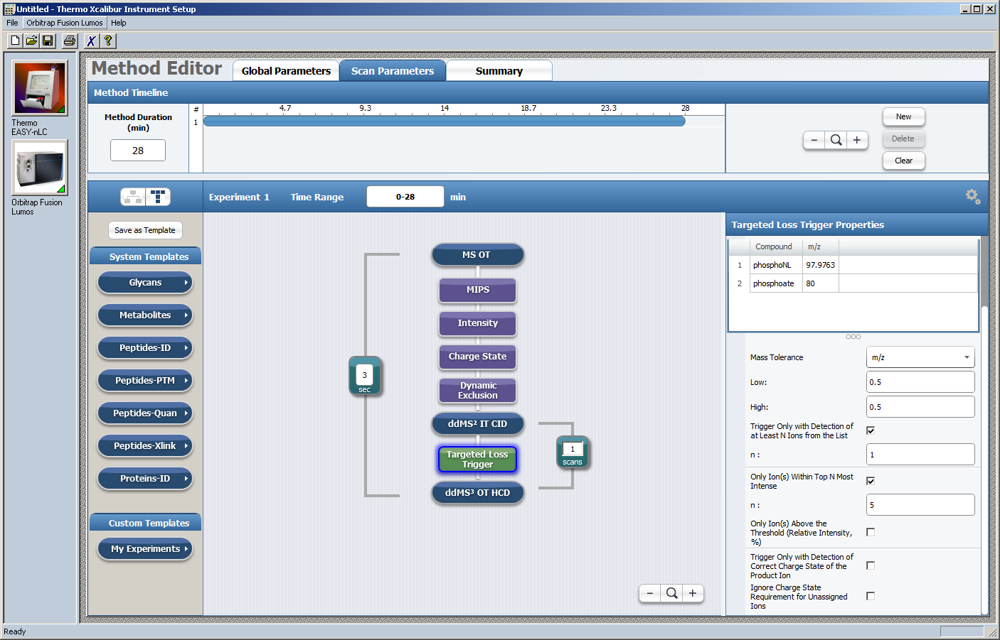

```{r, setup, include=FALSE}
knitr::opts_chunk$set(cache=TRUE, fig.height=5, collapse=TRUE, comment="#")
suppressPackageStartupMessages(library("mzR"))
suppressPackageStartupMessages(library("MSnbase"))
suppressPackageStartupMessages(library("msdata"))
suppressPackageStartupMessages(library("RColorBrewer"))
if (packageVersion("mzR") < "2.13.1") {
    stop("For this example you need at least mzR 2.13.1 ",
         "(because of the filter string feature).")
}
col <- paste0(brewer.pal(5, "Set1"))
names(col) <- c("MS1", "MS2", "MS3", "NL80", "NL97")

plotMs2 <- function(s, xlim=range(mz(s)), ylim=c(0, max(intensity(s)) * 1.1), tol=0.5) {
    plot(NA, xlim=xlim, ylim=ylim, xlab="m/z", ylab="intensity")
    lines(mz(s), intensity(s), type="h", col=col["MS2"])
    n <- order(intensity(s), decreasing=TRUE)[1:5]
    top5mz <- mz(s)[n]
    sel <- unique(c(which(abs(precursorMz(s) - (top5mz + nl["phosphate"])) < tol),
                    which(abs(precursorMz(s) - (top5mz + nl["phosphoNL"])) < tol)))
    nt <- n[sel]

    if (length(nt)) {
        x <- mz(s)[nt]
        y <- intensity(s)[nt]
        nlcol <- col[ifelse(precursorMz(s) - x > nl["phosphate"], "NL97", "NL80")]
        lines(x, y, col=nlcol, lwd=1.5, type="h")
        points(x, y, col=nlcol, pch=20)
        text(x, y, paste0(round(x, 4), "(top ", sel, ")"), pos=3, col=nlcol)
        lg <- paste(c("rt", "precursorMz", "NL mz"),
                    round(c(rtime(s) / 60, precursorMz(s), mz(s)[nt]), 4),
                    sep=": ")
    } else {
        mi <- min(intensity(s)[n])
        abline(v=precursorMz(s) - nl, col=col[c("NL80", "NL97")], lty=2)
        text(precursorMz(s) - nl, max(intensity(s)), c("NL80", "NL97"),
             pos=c(4, 2), col=col[c("NL80", "NL97")])
        abline(h=mi, col="#808080", lty=4)
        text(xlim[1], mi, "top5", col="#808080", pos=3)
        lg <- paste(c("rt", "precursorMz"),
                    round(c(rtime(s) / 60, precursorMz(s)), 4),
                    sep=": ")
    }
    legend("topleft", legend=lg, bty="n")
}
```

## Availability

https://github.com/sgibb/talk-odense-20171127/

github: [\@sgibb](https://github.com/sgibb) /
twitter: [\@sebastiangibb](https://twitter.com/sebastiangibb)

<!--
## Loading Data with `mzR` [@mzR]

\small
```{r, mzR}
library("mzR")

fh <- openMSfile("TMT_Erwinia.mzML.gz")

header(fh)[1:2, 1:5]

peaks(fh, 2)[1:2, ]

close(fh)
```
-->

## Loading Data with `MSnbase` [@MSnbase]

```{r, MSnbase, eval=FALSE}
library("MSnbase")

msfile <- file.path(
    "data",
    "neutral-loss",
    "LUM2_01470_KS_L1-5-2_EC17-123-150In2_55oC_NLtrig.mzML.gz"
)

ms <- readMSData(msfile, mode="onDisk")
```
```{r, readRDS, eval=TRUE, echo=FALSE}
ms <- readRDS(file.path("data", "neutral-loss", "mnltrig.rds"))
```

## The `MSnExp` object

\tiny
```{r, MSnExp}
ms
```

## The `MSnExp` object 2

\small
```{r, MSnExp2}
head(featureNames(ms))

fData(ms)[1:2, 1:6]

ms[[1]]
```

## Plot a Spectrum of an `MSnExp` object

\small
```{r, plotMSnExp}
s <- ms[[95]]
plot(mz(s), intensity(s), type="h")
```

## Filter by MS level

```{r, filterMsLevel}
ms1 <- ms[fData(ms)$msLevel == 1]

ms1 <- filterMsLevel(ms, 1)
ms2 <- filterMsLevel(ms, 2)
ms3 <- filterMsLevel(ms, 3)
```

## The `MSnExp` object 3

\tiny
```{r, ms1}
ms1
```

## TIC

\small
```{r, TIC}
plot(rtime(ms1) / 60, tic(ms1),
     type="l", col="red",
     main="TIC", xlab="rt [min]", ylab="intensity")
```

## BPI

\small
```{r, BIC}
plot(rtime(ms1) / 60, fData(ms1)$basePeakIntensity,
     type="l", col="blue",
     main="BPI", xlab="rt [min]", ylab="intensity")
```

## IIT MS1

\small
```{r, IITMS1}
hist(fData(ms1)$injectionTime,
     col=col["MS1"],
     main="Ion Injection Time MS1", xlim=c(0, 0.055))
```

## IIT MS2

\small
```{r, IITMS2}
hist(fData(ms2)$injectionTime,
     col=col["MS2"],
     main="Ion Injection Time MS2", xlim=c(0, 0.055))
```

## IIT MS3

\small
```{r, IITMS3}
hist(fData(ms3)$injectionTime,
     col=col["MS3"],
     main="Ion Injection Time MS3", xlim=c(0, 0.055))
```

## IIT vs RT MS1

\small
```{r, IITvsRTMS1}
plot(rtime(ms1) / 60, fData(ms1)$injectionTime,
     type="l", col=col["MS1"],
     main="Ion Injection Time MS1",
     xlab="rt [min]", ylab="iit [sec]")
```

## MS1 per minute

\small
```{r, MS1pm}
plot(table(round(rtime(ms1) / 60)),
    type="l", col=col["MS1"], main="# MS1/min",
    xlab="rt [min]", ylab="# of MS1 spectra [/min]")
```

## MS2 per minute

\small
```{r, MS2pm}
plot(table(round(rtime(ms2) / 60)),
    type="l", col=col["MS2"], main="# MS2/min",
    xlab="rt [min]", ylab="# of MS2 spectra [/min]")
```

## MS3 per minute

\small
```{r, MS3pm}
plot(table(round(rtime(ms3) / 60)),
    type="l", col=col["MS3"], main="# MS3/min",
    xlab="rt [min]", ylab="# of MS3 spectra [/min]")
```

## NL trigger [@jiang2017]

![[Fig. 1 in @jiang2017]](images/jiang2017-fig1.png)

## NL trigger/LUMOS



## NL trigger/How to find our own trigger? 1

\small
```{r, Top5}
findTop5mz <- function(x) {
    mz(x)[order(intensity(x), decreasing=TRUE)[1:5]]
}
top5mz <- spectrapply(ms2, findTop5mz)
top5mz <- do.call(rbind, top5mz)
top5mz[1:2, ]

deltamz <- precursorMz(ms2) - top5mz
deltamz[1:2, ]
```

## NL trigger/How to find our own trigger? 2

\small
```{r, NL}
nl <- c(phosphate=80, phosphoNL=97.9763)
tolerance <- 0.5 # [Da]

# How many phosphates?
nl80 <- as.logical(rowSums(
    abs(deltamz - nl["phosphate"]) <= tolerance)
)
sum(nl80)

# How many phosphoNL?
nl97 <- as.logical(rowSums(
    abs(deltamz - nl["phosphoNL"]) <= tolerance)
)
sum(nl97)
```

<!--
## NL trigger/Spectra + NL vs RT

\small
```{r, MSNLvsRT}
plot(NA, ylim=c(0.1, 1100), xlim=c(0, 120),
     main="spectra vs rtime", xlab="rt [min]", ylab="# of spectra")
l <- list(ms1, ms2, ms3, ms2[nl80], ms2[nl97])
for (i in seq(along=l)) {
    lines(table(round(rtime(l[[i]]) / 60)), col=col[i], type="l")
}
legend("topleft", legend=names(col), col=col, pch=20, bty="n")
```
-->

## NL trigger/Spectra + NL vs RT log

\small
```{r, MSNLvsRTlog}
plot(NA, ylim=c(1, 1100), xlim=c(0, 120), log="y",
     main="spectra vs rtime", xlab="rt [min]", ylab="# of spectra")
l <- list(ms1, ms2, ms3, ms2[nl80], ms2[nl97])
for (i in seq(along=l)) {
    lines(table(round(rtime(l[[i]]) / 60)), col=col[i], type="l")
}
legend("topleft", legend=names(col), col=col, pch=20, bty="n")
```

## NL trigger/Find device trigger; the tricky part 1

\tiny
```{r, ms23df, echo=-c(5, 7)}
fData(ms2)$filterString[1:2]
fData(ms3)$filterString[1:2]

ms2df <- data.frame(scanId=scanIndex(ms2),
                    pcCid=gsub(".*ms2 *([0-9.]+@cid[0-9.]+) .*", "\\1",
                               fData(ms2)$filterString),
                    stringsAsFactors=FALSE)
knitr::kable(head(ms2df, 2))
ms3df <- data.frame(scanId=scanIndex(ms3),
                    pcCid=gsub(".*ms3 *([0-9.]+@cid[0-9.]+) .*", "\\1",
                               fData(ms3)$filterString),
                    stringsAsFactors=FALSE)
knitr::kable(head(ms3df, 2))
```

## NL trigger/Find device trigger; the tricky part 2

\small
```{r, ms23dfmerge, echo=-3}
nldf <- merge(ms3df, ms2df, by="pcCid",
              all.x=TRUE, all.y=FALSE,
              sort=FALSE, suffixes=c(".ms3", ".ms2"))
nldf$delta <- nldf$scanId.ms3 - nldf$scanId.ms2
knitr::kable(head(nldf))
```

## NL trigger/Find device trigger; the tricky part 3

\small
```{r, ms23dfreduce, echo=-6}
nldf <- nldf[nldf$delta > 0,]

nldf <- nldf[order(nldf$scanId.ms3, nldf$delta),]

nldf <- nldf[!duplicated(nldf$scanId.ms3),]
knitr::kable(head(nldf))
```

## NL trigger/Find common trigger/differences 1

\small
```{r, upset}
ms2idNL <- list(own=scanIndex(ms2)[nl80 | nl97],
                thermo=nldf$scanId.ms2)

library("UpSetR")
upset(fromList(ms2idNL), order.by="freq")
```

## NL trigger/Find common trigger/differences 2

```{r, sets}
common <- intersect(ms2idNL$own, ms2idNL$thermo)
uniqueOwn <- setdiff(ms2idNL$own, ms2idNL$thermo)
uniqueThermo <- setdiff(ms2idNL$thermo, ms2idNL$own)
```

## NL trigger/Common trigger

\small
```{r, plotMs2com, fig.height=7}
plotMs2(ms[[common[1]]])
```

## NL trigger/Should have been triggered

\small
```{r, plotMs2own, fig.height=7}
plotMs2(ms[[uniqueOwn[1]]])
```

## NL trigger/Was triggered but shouldn't

\small
```{r, plotMs2thermo, fig.height=7}
plotMs2(ms[[uniqueThermo[1]]])
```

## NL trigger/Trigger tolerance

\tiny
```{r, histTol, echo=-1, fig.height=6}
par(mfrow=c(1, 3))
l <- list(common=common, own=uniqueOwn, thermo=uniqueThermo)
i <- lapply(l, match, scanIndex(ms2))
for (j in seq(along=l)) {
    minDelta <- apply(deltamz[i[[j]], ], 1, function(r)min(abs(r - rep(nl, each=length(r)))))
    hist(minDelta, breaks=seq(0, 2.1, by=0.1), ylim=c(0, 675), main=names(l)[j])
}
```

## Thanks

- MSnbase: [\@lgatto](https://github.com/lgatto), [\@jotsetung](https://github.com/jotsetung)
- mzR: [\@sneumann](https://github.com/sneumann), [\@lgatto](https://github.com/lgatto), [\@jotsetung](https://github.com/jotsetung)

## Availability

https://github.com/sgibb/talk-odense-20171127/

github: [\@sgibb](https://github.com/sgibb) /
twitter: [\@sebastiangibb](https://twitter.com/sebastiangibb)

## References
